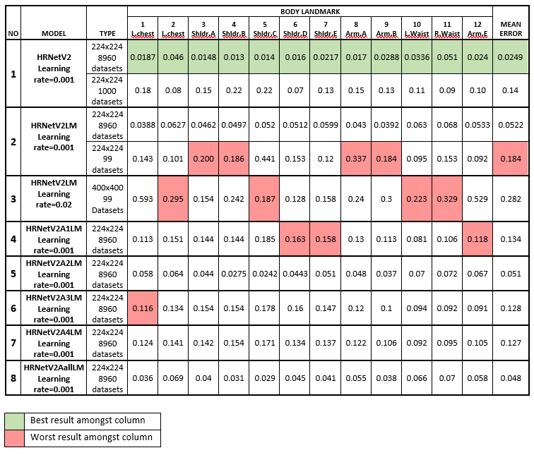

# Body Landmark Detection based on High-Resolution Network  
Name      : Ng Yao Hong
Student ID: 20107125
This is the code for Body Landmark Detection based on High-Resolution Network an FYP project. 
The git hub repo can be found using this [link](https://github.com/Tim-Ng/LMHRnet)

## Files
```
project
│   README.md
│   test.ipynb  
│   train.ipynb
|   requirements.txt
|
└───dataset
│   │
│   └───csv_file
│   |    │   custlrinfo101.csv
│   |    │   test.csv
│   |    │   ...
|   |
|   |
│   └───custlr
|        └───auged
|              |   1.jpg
|              |   2.jpg
|              |   ...
|
|
└───experiments
│   │
│   └───lip
│       │   hrnet_w48_landmark224_1000_aug.yaml
│       │   hrnet_w48_landmark400_100.yaml
│       │   ...
|
|
└───lib
│   │
│   └───config
│   │    │   __init__.py
│   │    │   hrnet_w48_landmark400_100.yaml
│   │    │   default.py
│   │    │   hrnet_config.py
│   │    │   models.py
|   │
|   └───core
│   │    │   criterion.py
│   │    │   function.py
|   │
|   │
|   └───datasets
│   │    │   __init__.py
│   │    │   base_dataset.py
│   │    │   bodylandmark.py
│   │    │   lip.py
|   │
|   └───models
│   │    │   __init__.py
│   │    │   hrnet.py
│   │    │   bn_helper.py
│   │    │   seg_hrnet_bodylandmark.py
│   │    │   seg_hrnet_bodylandmark_attention_1.py
│   │    │   seg_hrnet_bodylandmark_attention_2.py
│   │    │   ...
│   │    │   
│   │    └───sync_bn
│   │          │  ...
│   │         
│   │
│   └───src
│       │   __init__.py
│       │   utils_v2.py
|
|
└───pred_visualized
│   │
│   └───alt
│   |    └───v3_mine-v-gdrive
│   |               │   body_landmark lm param epoch=20 lr =0.001 size=224 8960 dataset 0-78 dataset 11060_hm0.jpg
│   |               │   ...
│   |    
│   |    
│   └───gt
│        └───test
│              │   body_landmark lm param epoch=20 lr =0.001 size=224 8960 dataset 0-78 dataset 11060_img0.jpg
│              │   ...
|
|
|
└───pretrained models
│   │    body_landmark lm param epoch=1 lr =0.001 size=224 8960 dataset 0-78 dataset 1200.pkl
│   |    hrnet_w48_lip_cls20_473x473.pth
│   |    ...
│   |    
│   └───experiment layers graph
│         |
|         |
|         └─── training losslm
│         |        |       training loss lm param epoch=1 lr =0.001 size=224 8960 dataset 0 -78 dataset 1200 body_landmark.png
│         |        |       ...
│         |
│         |
│         └─── val losslm
|                  |       val loss lm param epoch=1 lr =0.001 size=224 8960 dataset 0 -78 dataset 1200 body_landmark.png
│                  |       ...
│
│
└───tools
      │    __init__.py
      |    test.py
      |    train.py

```
## Extra files to download
The dataset file and pertrain_models file is too large to upload <br>
Other methods: <br>
1. [OneDrive Link]() <br>
2. [Google Drive](https://drive.google.com/drive/folders/1kURjA7hOH-pKAyxkSYEb33Ar8DvImS1o?usp=sharing)


## Presentable files:

Run the IPython notebook [test.ipynb](test.ipynb) for examples of testing. <br>
Run the IPython notebook [train.ipynb](train.ipynb) for examples of training.

## To start 
Please download the requirements from the requirement.txt file. Its a direct export from Conda. <br>

The .yaml files in the [experiment folder](/experiment) are the configuration file that will allow you to tweak the network as well as change where to aquire the training, validation and test datasets. <br>

The .pkl files in the [pretrained models](/pretrained models) is where the train networks can be found. <br>

The graph for training is saved in [pretrained models/experiment layers graph](/pretrained models/experiment layers graph) <br>

The files for the models are located in [/lib/models](/lib/models) <br>


## Train networks performance:


